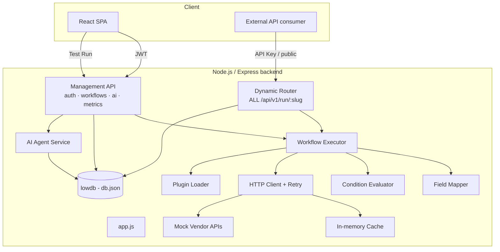
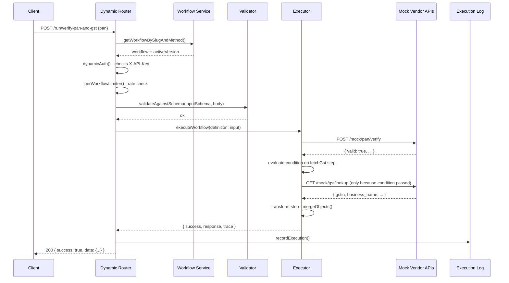

# Architecture

## Component diagram



## Request lifecycle: `POST /api/v1/run/verify-pan-and-gst`



## Why a single dynamic route instead of registering one Express route per workflow

Two options were on the table:

1. Register a real Express route (`app.post('/run/verify-pan', handler)`) every
   time a workflow is created or published.
2. Register **one** route for the whole pattern (`app.all('/run/:slug', handler)`)
   that looks up the matching workflow from the database at request time.

Option 1 needs some way to add/remove routes from a running Express app
without restarting the process, which Express doesn't support cleanly (you'd
be maintaining a shadow router and re-mounting it, or restarting workers).
Option 2 is what's implemented — `backend/src/services/dynamicRouter.js` — and
it has a nice side effect: publishing, unpublishing, or rolling back to a
previous version is *purely a database write*. Zero code changes, zero
restarts, exactly what "configuration-driven" is supposed to mean.

The cost is one extra DB lookup per request, which for a file-backed lowdb
store is effectively free, and would be a non-issue with a real database and
an index on `(slug, method)`.

## The executor's context object

Every workflow run builds up a single `context` object:

```js
{
  input: { body, query, params, headers },   // the incoming request
  steps: {
    verifyPan: { request, response, status },
    fetchGst:  { status: 'skipped' },         // condition was false
    merged:    { output, status },
  }
}
```

Every later step, condition, and the final `response` mapping all read from
this same object via `{{steps.stepId.path.to.value}}`. Nested steps inside a
`parallel` block write into the *same* top-level `steps` map (not a nested
one) — a `verify-document` request can freely reference
`steps.fraudCheck.response.data.flagged` even though `fraudCheck` lives inside
a `parallelChecks` group, which is why the sample config reads naturally
without needing to know about the grouping.

## Plugin architecture

`backend/src/engine/pluginLoader.js` reads every `.js` file in
`backend/src/plugins/` at boot and registers whatever functions it exports.
A `transform` step just references `{ plugin: "formatters", fn: "maskPan" }`.
Adding a new transformation is: write a function, export it, done — nothing
else in the engine, routes, or database schema needs to know it exists.
